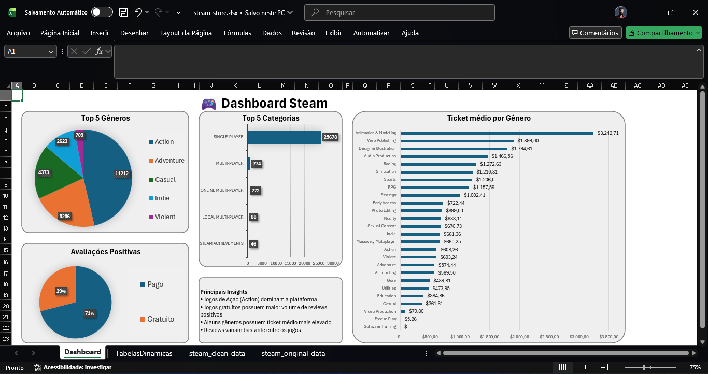

# 🎮 Análise de Jogos da Steam com Excel

## 📌 Objetivo do Projeto

Este projeto foi desenvolvido com o objetivo de praticar análise de dados utilizando Excel, explorando informações de jogos da Steam através de organização, tratamento e visualização de dados.

O foco principal foi desenvolver habilidades iniciais em:

- análise exploratória de dados;
- limpeza de dados;
- tabelas dinâmicas;
- gráficos;
- dashboards;
- interpretação de métricas.

---

## 📊 Dataset Utilizado

Dataset público contendo informações de jogos disponíveis na Steam.

Os dados incluem:

- nome dos jogos;
- gêneros;
- preços;
- quantidade de avaliações;
- publishers;
- categorias.

---

## 🛠 Ferramentas Utilizadas

- Microsoft Excel
- Tabelas Dinâmicas
- Fórmulas básicas e intermediárias
- Gráficos
- Dashboard

---

## 📂 Estrutura da Planilha

A planilha foi organizada em diferentes etapas do processo analítico:

### Dados Originais

Contém o dataset bruto utilizado no projeto.

### Tratamento de Dados

Etapa de organização e limpeza das informações para facilitar as análises.

### Análises

Criação de métricas, tabelas dinâmicas e exploração dos dados.

### Dashboard

Visualização gráfica dos principais indicadores encontrados durante a análise.

---

## 🔍 Perguntas Analisadas

Durante o projeto foram exploradas perguntas como:

- Quais gêneros possuem mais jogos?
- Jogos gratuitos possuem mais avaliações?
- Quais jogos possuem maior número de reviews?
- Qual o ticket médio por categoria?

---

## 📈 Dashboard

O dashboard foi desenvolvido para facilitar a visualização dos dados e destacar informações relevantes sobre os jogos da Steam.

### Indicadores utilizados

- quantidade total de jogos;
- distribuição por gênero;
- jogos mais populares;
- comparações entre jogos gratuitos e pagos.

---

## 📚 Aprendizados

Durante este projeto pratiquei:

- organização de bases de dados;
- limpeza de informações;
- utilização de tabelas dinâmicas;
- construção de gráficos;
- análise exploratória;
- visualização de dados no Excel.

---

## 🚀 Próximos Passos

Futuramente pretendo:

- aprofundar as análises;
- recriar o projeto em Power BI;
- utilizar SQL para consultas;
- melhorar o dashboard visualmente;
- adicionar novos indicadores.

---

## 👨‍💻 Autor

Caike Thiago Santos
Estudante de Ciência de Dados (1º semestre)
